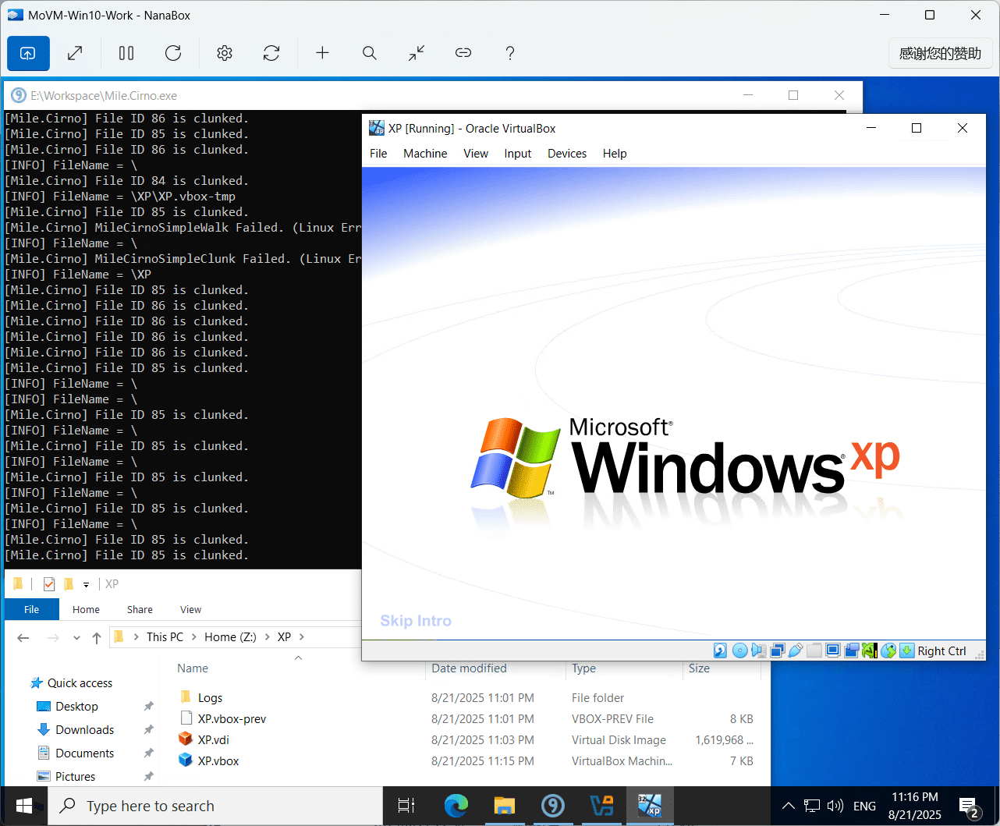

# Mile.Cirno

9p for Windows



## Why named Cirno?

I think many people who love MAG/ACGN will think 9 -> ⑨ -> Cirno.

Read https://en.wikipedia.org/wiki/List_of_Touhou_Project_characters#Cirno for
more information.

## Features

- Provide read and write client support for 9P2000.L protocol, based on
  [Mile.Dokany](https://github.com/ProjectMile/Mile.Dokany), the customized
  version of [Dokany](https://github.com/dokan-dev/dokany) which user-mode
  library is specialized for NuGet integration and optimized for binary size.
- Support 9p transport over TCP or Hyper-V Socket.
- Provide NanaBox EnableHostDriverStore integration mode.

## Usage

Execute "Installer.cmd" as administrator in the "Driver" folder to install the
Dokany driver first.

Then execute Mile.Cirno with the command line help.

```
Format: Mile.Cirno [Command] <Option1> <Option2> ...

Commands:

  Help - Show this content.

  Mount TCP [Host] [Port] [AccessName] [MountPoint]
    - Mount the specific 9p share over TCP.
  Mount HvSocket [Port] [AccessName] [MountPoint]
    - Mount the specific 9p share over Hyper-V Socket.

Notes:
  - All command options are case-insensitive.
  - Mile.Cirno will run as the NanaBox EnableHostDriverStore
    integration mode if you don't specify another command, which
    is equivalent to the following command:
      Mile.Cirno Mount HvSocket 50001 HostDriverStore %SystemRoot%\System32\HostDriverStore
Examples:

  Mile.Cirno Mount TCP 192.168.1.234 12345 MyShare C:\MyMount
  Mile.Cirno Mount HvSocket 50001 HostDriverStore Z:\
```

There are some requirements if you are the NanaBox user who want to use GPU-PV
in your Windows guest.

- The minimum guest Windows version is Windows 10 Version 1809 (Build 17763)
  because GPU-PV is formally introduced in WDDM 2.5 which is the new feature
  in this baseline Windows version. But the recommend guest Windows version is
  Windows 10 Version 2004 (Build 19041) or later.
- Your graphics driver need to support WDDM 2.5 or later.
- You need to set Gpu configurations in your NanaBox Configuration File.
- Of course, EnableHostDriverStore option in Gpu configurations need to set true
  before you using NanaBox EnableHostDriverStore integration mode.
- After you start Mile.Cirno successfully, you need to go to Device Manager to
  disable the GPU-PV device(s) you want to use first and then enable to make
  Windows reload the related device. Also, you need to do this operation before
  you switching to the Enhanced Session mode due to some issues in Terminal 
  Services.
- You should disable the GPU-PV device(s) you are using before you exit the
  Mile.Cirno.

## System Requirements

- Supported OS: Windows 10 Version 2004 (Build 19041) or later
- Supported Platforms: x86, x86-64(AMD64) and ARM64

## Todo List

- [ ] Provide 9p2000 and 9p2000.u support.
- [ ] Support 9p transport over VirtIO.
- [ ] Simple server implementation.

## Documents

- [License](License.md)
- [Release Notes](ReleaseNotes.md)
- [Versioning](Versioning.md)

## Credits

Note: This list sort in alphabetical order.

- Kenji Mouri, https://github.com/MouriNaruto
- pericycle, https://github.com/per1cycle
  (Tabbleman, https://github.com/Tabbleman)
